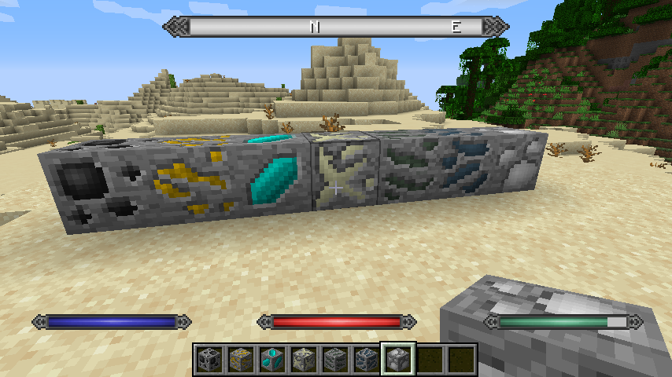
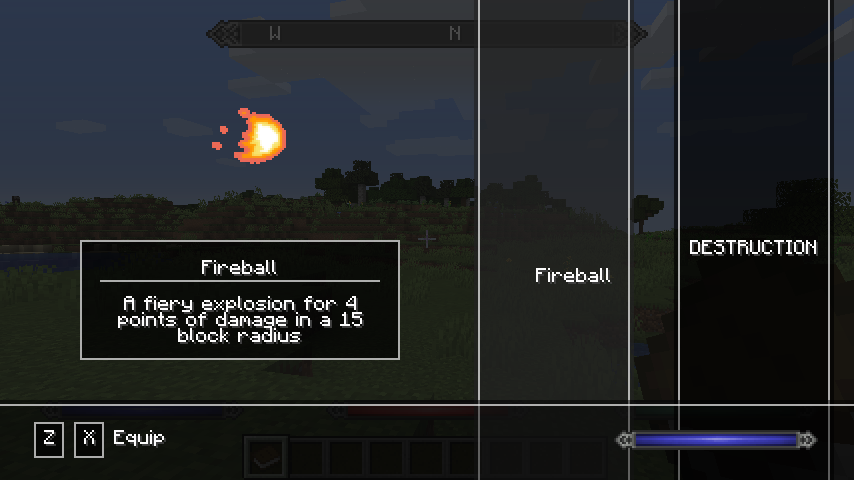

# Skyrimcraft

This is a [MinecraftForge](https://minecraftforge.net) mod which aims to bring the
world of Skyrim into Minecraft!

NB: This mod is currently in a pre-release state and thus, you may encounter some bugs.
If this is the case, please feel free to [report an issue](https://github.com/ryankshah/skyrimcraft/issues).

## Features

### Skyrim's In-Game GUI
This feature brings the Skyrim in-game GUI right to your Minecraft client!
##### What's included?
- [x] Magicka, health and stamina displays
- [x] Skyrim compass
- [x] Add enemy target health bar to in-game GUI
- [ ] **TODO:**
    - [ ] Include aggressive enemies to the in-game compass
    - [ ] Include **known** structures (i.e. villages) to the in-game compass

### Magicka, Spells and Shouts
This feature brings your world a magicka system which allows you to cast spells
and shouts found in Skyrim!
##### What's included?
- [x] Fully functioning magicka capability
- [x] Magic GUI (for displaying and selecting spells and shouts)
- [x] Learnable spells (via Spellbooks).
- [ ] **TODO:**
    - [ ] Add shout walls for learning shouts
    - [ ] Enable shouts to be learned in stages (i.e. Fus, Ro and Dah
          individually for the ability to learn the full shout and gradually
          gain its full effects)
    - [ ] Add spells and shouts:
        - [ ] Spells
            - [x] Fireball
            - [ ] ...
        - [ ] Shouts
            - [ ] Unrelenting Force (Fus Ro Dah)
            - [ ] Fire Breath (Yol Toor Shul)
            - [ ] Whirlwind Sprint (Wuld Nah Kest)
            - [ ] Disarm (Zun Haal Viik)
            - [ ] Dragon Aspect (Mul Qah Diiv)
            - [ ] ...

### Armour, Items, Ores, Weapons, etc.
This feature brings armour, items, weapons, ores, foods, and much more from
Skyrim into your Minecraft world!
##### What's included?

## Known Issues
- [ ] ...

## Screenshots

## Videos

Coming soon...

## Frequently Asked Questions

### How can I report an issue?
You can report an issue [right here](https://github.com/ryankshah/skyrimcraft/issues)!

### Can I use this mod in my modpack?
Go ahead! Just make ensure you abide by the following conditions:
1. You cannot claim that you own the entire mod or any parts of this mod
2. You must cite the author(s) of this mod
3. You must provide a link back to this page